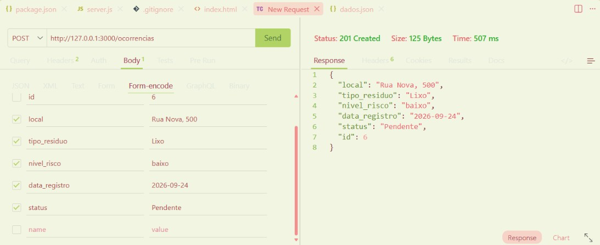
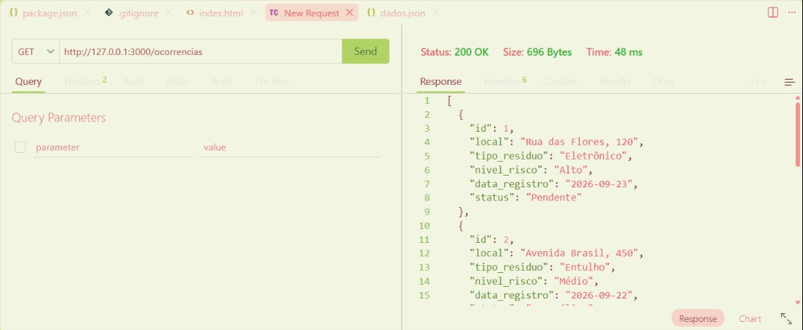
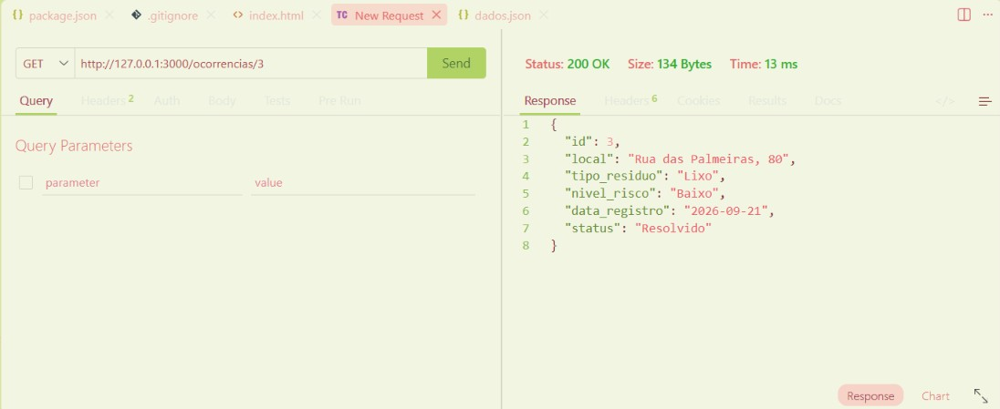
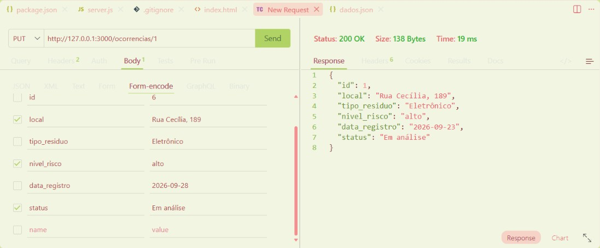
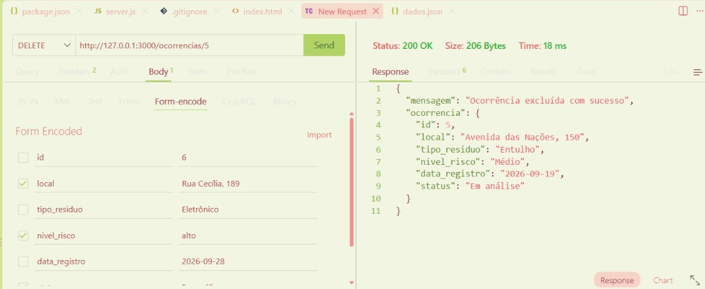
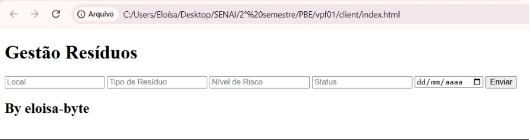
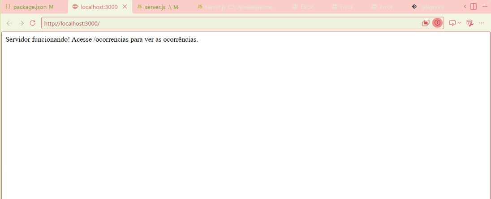
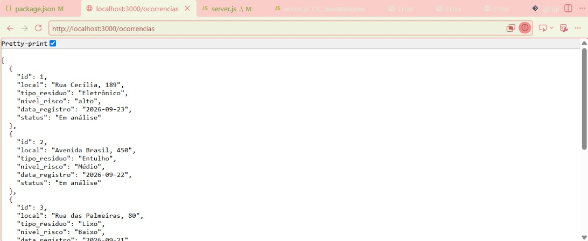

# Gestão de Resíduos Sólidos - Back-end

Sistema back-end desenvolvido para a Prefeitura de Amparo realizar o monitoramento de pontos de descarte irregular de resíduos sólidos, como lixo, entulho e resíduos eletrônicos.

O sistema permite cadastrar, consultar, atualizar e excluir ocorrências de descarte irregular.

---

## Tecnologias

- Node.js
- JavaScript
- VSCode
- Thunder Client
- HTML
- JSON

---

## Passos para testar

### 1. Clone este repositório

Clone o projeto para o seu computador.

### 2. Abra o projeto no VSCode

Abra a pasta do projeto no VSCode e abra um terminal.

### 3. Instale as dependências

No terminal, digite:

```bash
npm install

```

### 4. Teste as rotas com a extensão *Thunder Client* do VsCode

### 5. Abra o arquivo *client/index.html* com a extensão Live Server do VsCode

---

## Print dos Testes e exemplos de requisições

- CREATE


- READ ALL


- BUSCAR


- UPDATE


- DELETE


---

## Cliente



<br>



<br>

